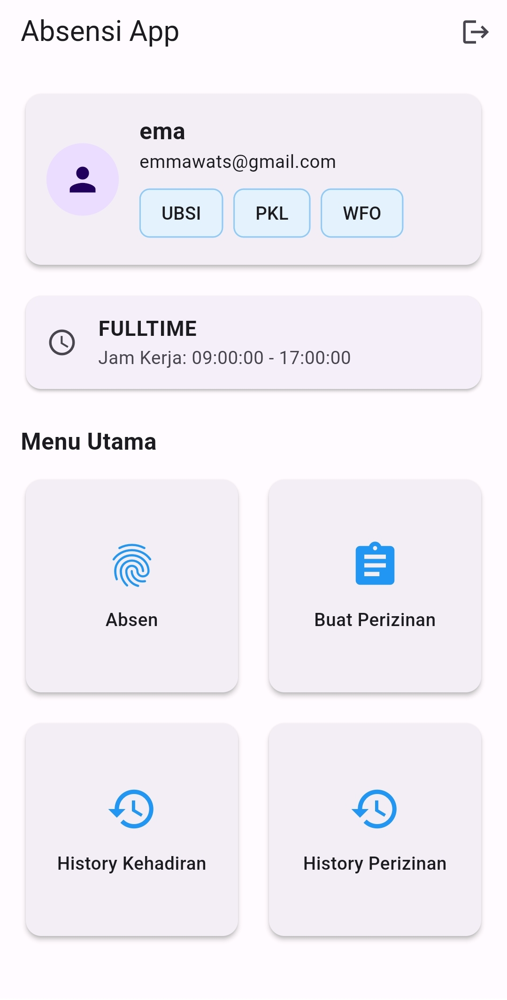
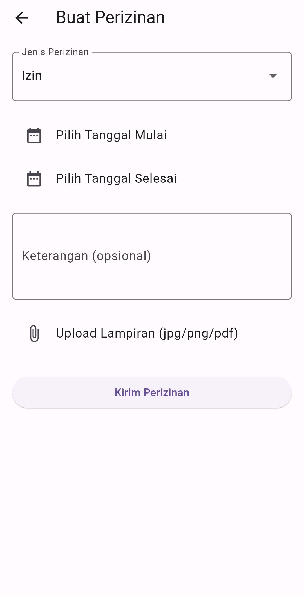
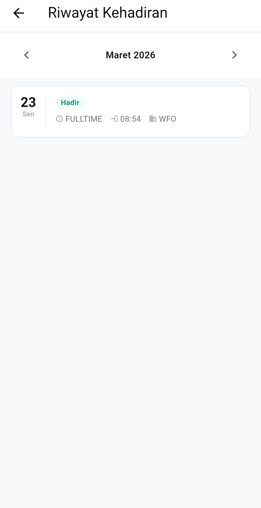
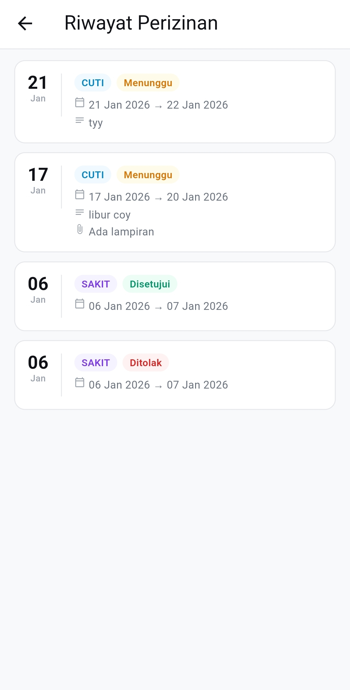

# App Absensi

# Aplikasi Absensi Karyawan

Aplikasi client untuk sistem absensi karyawan yang terhubung dengan backend API.  
Digunakan oleh karyawan untuk melakukan absensi, pengajuan izin, dan melihat riwayat.

---

## Deskripsi

Aplikasi ini memungkinkan karyawan untuk:

- Melakukan absensi dengan wajah atau foto
- Mengajukan izin / cuti
- Melihat riwayat absensi
- Melihat status pengajuan izin

---

## Tampilan Utama



---

## Fitur Utama

### Login

- Login menggunakan akun yang terdaftar.

---

### Absensi

- Absen masuk menggunakan:
  - Face capture (kamera)
  - Foto manual
- Validasi wajah ke server
- Deteksi:
  - Keterlambatan
  - Shift
  - Mode kerja (WFO/WFH)

---

### Perizinan

- Pengajuan:
  - Izin
  - Sakit
  - Cuti
- Input tanggal dan keterangan
- Upload bukti (opsional)

#### Tampilan Perizinan



---

### History Absensi

- Melihat riwayat absensi harian
- Informasi yang ditampilkan:
  - Tanggal
  - Status
  - Jam masuk
  - Keterlambatan

#### Tampilan History Absensi



---

### History Perizinan

- Melihat riwayat pengajuan izin
- Status pengajuan:
  - Pending
  - Disetujui
  - Ditolak

#### Tampilan History Perizinan



---

## Teknologi

- Flutter
- Dart
- FVM (Flutter Version Management)
- REST API
- Camera Integration
- Face Recognition API

---

## Cara Menjalankan

### 1. Clone Repository

```bash
git clone https://github.com/nur-santo/absensi-user.git
cd absensi-user
```

### 2. Install Dependency

```bash
fvm flutter pub get
```

### 3. Konfigurasi Environment

Isi file `.env` dengan alamat backend.

```env
API_IP=192.168.1.10
API_PORT=8000
```

Keterangan:

- `API_IP` : Alamat IP server backend (Admin Panel Laravel).
- `API_PORT` : Port backend, default `8000`.

Contoh URL API yang akan digunakan aplikasi:

```
http://192.168.1.10:8000
```

> Pastikan perangkat mobile dan server berada pada jaringan yang sama saat pengembangan.

### 4. Jalankan Aplikasi

```bash
fvm flutter run
```

Atau pilih device yang tersedia:

```bash
fvm flutter devices
fvm flutter run
```

---

## Alur Sistem

1. User login.
2. User melakukan absensi menggunakan kamera atau foto.
3. Data dikirim ke backend melalui REST API.
4. Backend melakukan validasi wajah.
5. Data absensi disimpan.
6. User dapat melihat riwayat absensi dan status pengajuan.

---

## Kelebihan Sistem

- Absensi lebih akurat menggunakan face recognition.
- Mendukung mode kerja WFO dan WFH.
- Monitoring kehadiran secara real-time oleh admin.
- Terintegrasi dengan REST API.

---

## Catatan

- Kamera diperlukan untuk fitur face recognition.
- Pastikan `API_IP` pada file `.env` mengarah ke server backend yang sedang berjalan.

---

## Admin Panel

Repository backend (Admin Panel) dapat diakses di:

https://github.com/nur-santo/absensi-admin
